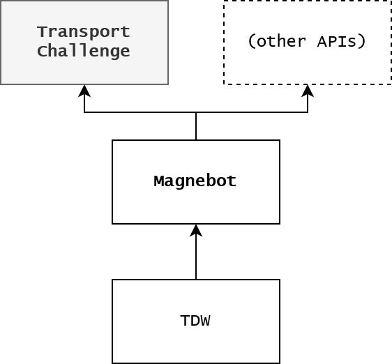

# Transport Challenge

In the Transport Challenge API, the [**Magnebot**](https://github.com/alters-mit/magnebot) must transport **target objects** (small objects scattered on the floor of a randomly-chosen room) with the aid of **containers** (box-shaped objects without lids that can hold target objects) to the **goal zone** (a circle defined by a position and a radius in the center of a room and the scene).

If all of the target objects are in the goal zone, the task is successful.

**[Read the API documentation here.](https://github.com/alters-mit/transport_challenge/blob/main/doc/transport_controller.md)**

The Transport Challenge API is an extension of the [Magnebot API](https://github.com/alters-mit/magnebot) which in turn is built on the [TDW simulation platform](https://github.com/threedworld-mit/tdw).



# Installation

1. [Follow instructions for installing the Magnebot API](https://github.com/alters-mit/magnebot)
2. Clone this repo
3. `cd path/to/transport_challenge` (Replace `path/to` with the actual path)
4. `pip3 install -e .`

# Usage

1. Run this controller:

```python
from transport_challenge import Transport

m = Transport()
# Initializes the scene.
status = m.init_scene(scene="2a", layout=1)
print(status)  # ActionStatus.success

# Prints a list of all container IDs.
print(m.containers)
# Prints a list of all target object IDs.
print(m.target_objects)

m.end()
```

2. [Launch the TDW build.](https://github.com/threedworld-mit/tdw/blob/master/Documentation/getting_started.md)

# Documentation

- **[API documentation](https://github.com/alters-mit/transport_challenge/blob/main/doc/transport_controller.md)**
- [Changelog](https://github.com/alters-mit/transport_challenge/blob/main/doc/changelog.md)

# Example controllers

- [This controller](https://github.com/alters-mit/transport_challenge/tree/main/controllers/examples/single_room.py) is an *example use-case*. It uses very naive logic to navigate (it assumes that everything is in the same room and that there aren't obstructions between objects) but it should be a good example of how to use this API.
- [This controller](https://github.com/alters-mit/transport_challenge/tree/main/controllers/demos/demo.py) is a *promo controller*. It is visually indicative of an actual use-case and includes an overhead camera so that it's easy to see what's going on. However, this controller includes a lot of code that you shouldn't add to your controller because it's unnecessary, inflexible, and slow.
- [These controllers](https://github.com/alters-mit/transport_challenge/tree/main/controllers/tests) are *test controllers*. They are meant only for testing the API.
